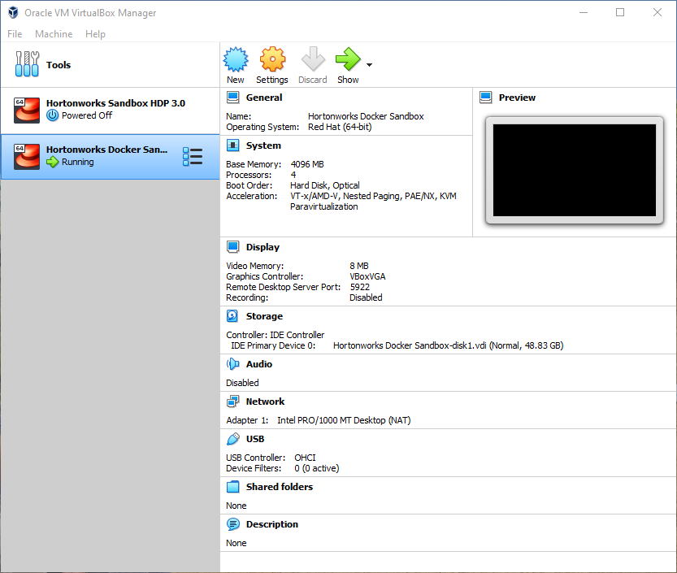
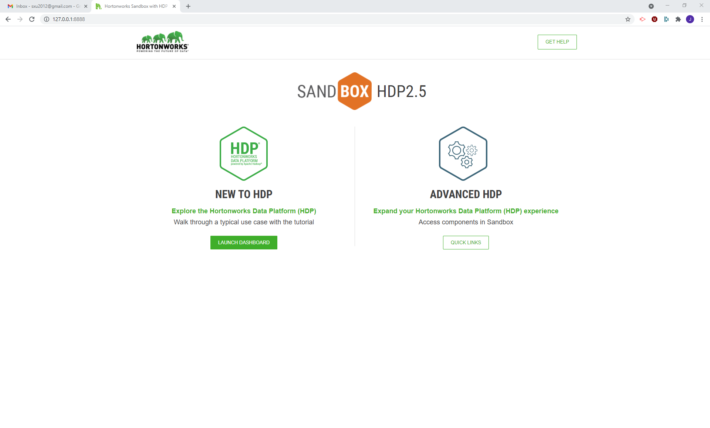
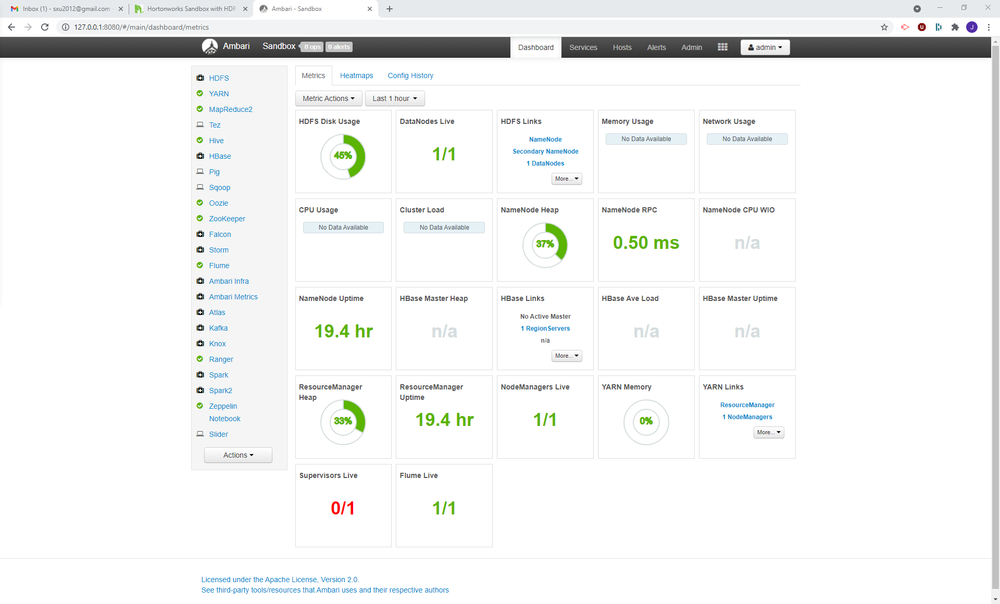
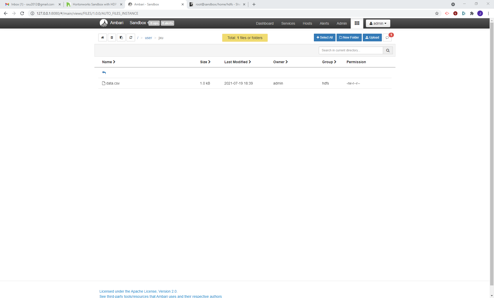
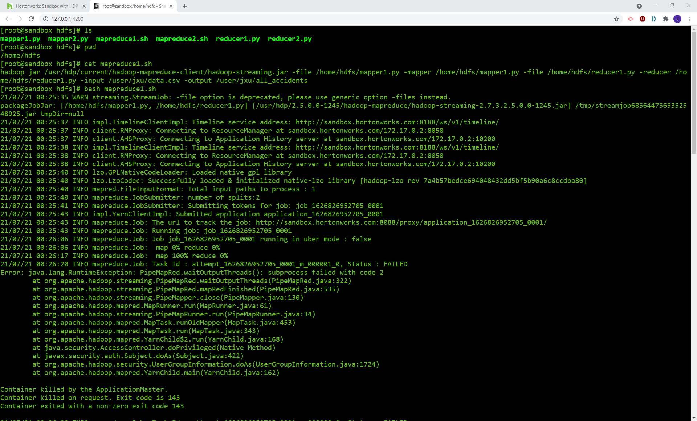
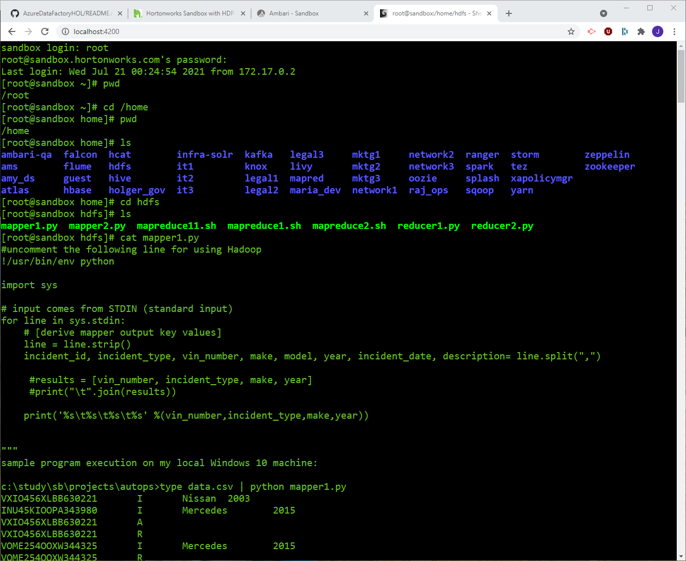
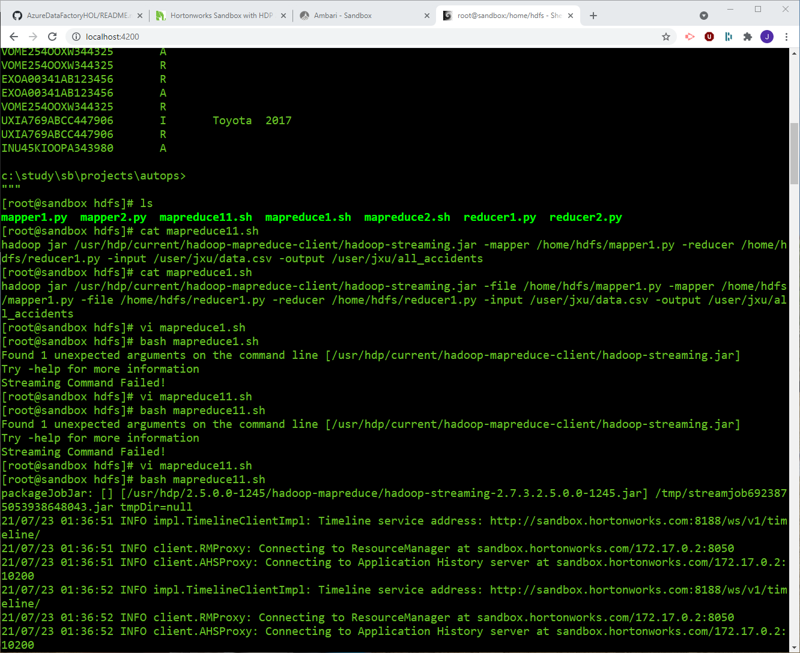
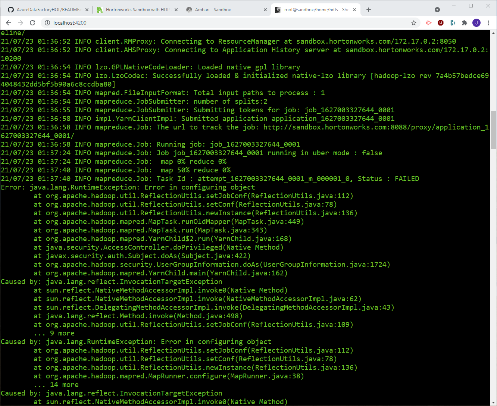
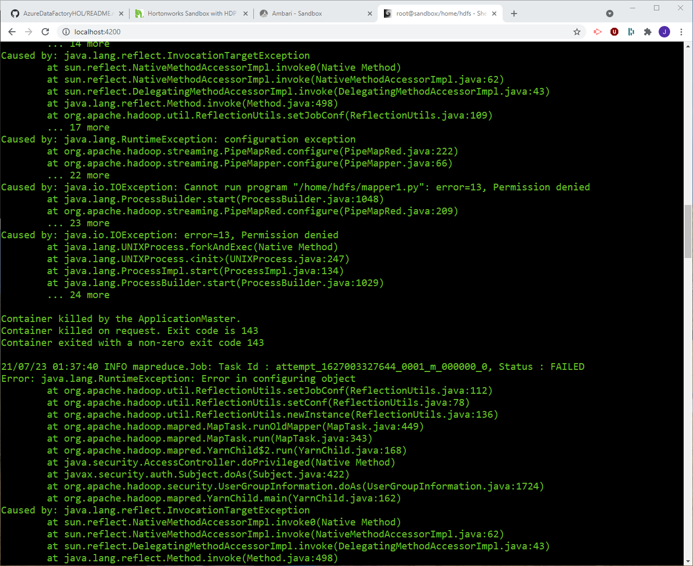
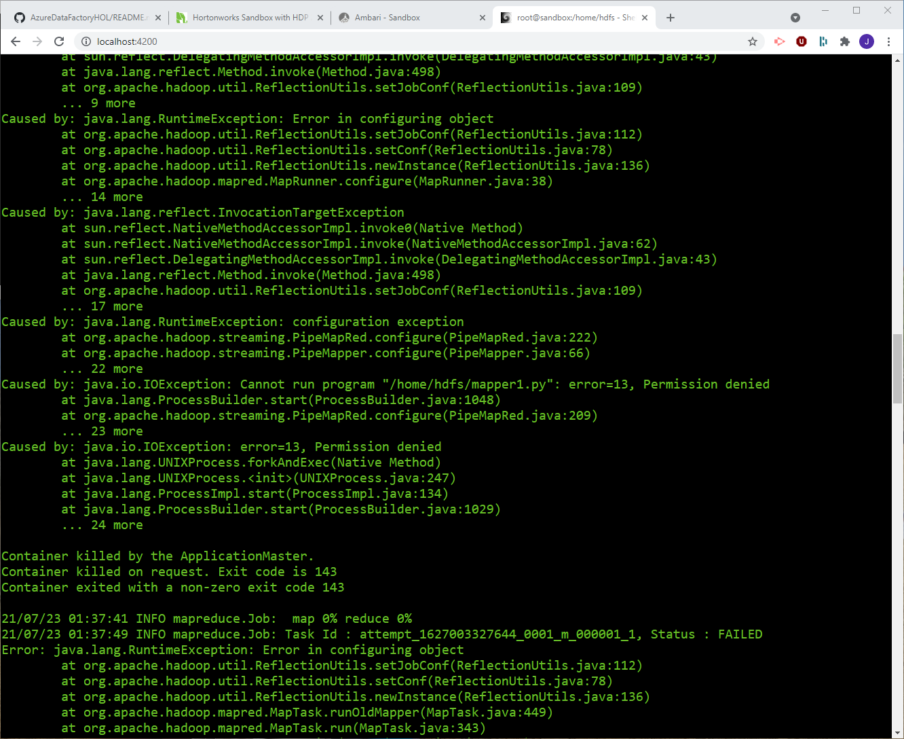

# Hadoop Mini Project: Post Sale Automobile Report

Input is a dataset of CSV files with a history report of various vehicles, the goal is to write a MapReduce program to produce a report of the total number of accidents per make and year of the car

Hadoop Setup: Hortonworks Hadoop Sandbox

## 1.1 mapper1.py - Reads the CSV files and output key value paires where key is the vin number and output is the incident type, make and year. A test result in the local PC is attached below:

"""
sample program execution on my local Windows 10 machine:

c:\study\sb\projects\autops>type data.csv | python mapper1.py  
VXIO456XLBB630221       I       Nissan  2003  
INU45KIOOPA343980       I       Mercedes        2015  
VXIO456XLBB630221       A   
VXIO456XLBB630221       R  
VOME254OOXW344325       I       Mercedes        2015  
VOME254OOXW344325       R  
VXIO456XLBB630221       R  
EXOA00341AB123456       I       Mercedes        2016  
VOME254OOXW344325       A  
VOME254OOXW344325       R  
EXOA00341AB123456       R  
EXOA00341AB123456       A  
VOME254OOXW344325       R  
UXIA769ABCC447906       I       Toyota  2017  
UXIA769ABCC447906       R  
INU45KIOOPA343980       A  

c:\study\sb\projects\autops>
"""
## 1.2 reducer1.py - Reads the output from mapper1 which is already sorted and grouped by vin by hadoop, capture the make and year for each group, then output each accident (incident type 'A') when the vin changes.

"""  
Sample execution of mapper1.py and reducer1.py on local machine:

c:\study\sb\projects\autops>type data.csv | python mapper1.py | sort | reducer1.py  
Mercedes        2016  
Mercedes        2015  
Mercedes        2015  
Nissan  2003

c:\study\sb\projects\autops>  
"""
## 2.1 mapper2.py - Reads the output from reducer1.py, and output key value pair where key is a combination of make and year, value is 1

"""  
Sample result running on local PC:  
c:\study\sb\projects\autops>type data.csv | python mapper1.py | sort | reducer1.py | mapper2.py  
Mercedes-2016   1  
Mercedes-2015   1  
Mercedes-2015   1  
Nissan-2003     1  

c:\study\sb\projects\autops>  
"""

## 2.2 reducer2.py - output the number of accidents for each maker/year  
"""  
Sample output from running on a local PC:

c:\study\sb\projects\autops>type data.csv | python mapper1.py | sort | reducer1.py | mapper2.py | sort | reducer2.py  
Mercedes-2015   2  
Mercedes-2016   1  
Nissan-2003     1

c:\study\sb\projects\autops>  
"""
Run Hadoop-Streaming Map/Reduce job:

## 3.1 Set up Hortonworks Sandbox HDP version 2.5 on Oracle VM VirtualBox on windows 10 PC. Set the Base Memory of the Sandbox to 4096MB.

## 3.2 Open http://127.0.0.1:8888/

## 3.3 Login to Ambari as admin and upload data.csv to /user/jxu

## 3.4 Login to localhost:4200 as root, create mapper1.py mapper2.py reducer1.py reducer2.py mapreduce1.sh mapreduce2.sh in the  host machine /home/hdfs folder and chmod +x to make them executable 

## 3.5 Run the command #bash mapreduce1.sh, also tried mapreduce11.sh. Both failed: 

Attach the complete screen captures below:

